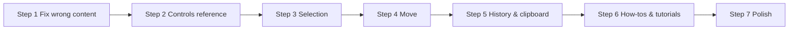

# User documentation update — editor features

**Status:** Plan  
**Audience:** End users (docs site at `docs.rackflow.app`)  
**Created:** 2026-07-03  
**Source of truth (implementation):** `frontend/docs/editor-interaction.md`, `frontend/src/editor/README.md`

---

## Why this plan exists

The public docs (`docs/src/content/docs/`) still describe a pre-2026 editor: toolbar-only delete with the **D** key, no camera guide, no selection/marquee, no keyboard move, no undo/redo UI, no copy/paste. A large batch of editor features shipped recently but is only documented for developers inside `frontend/`.

This plan brings the **user-facing** site up to date in small, shippable steps.

---

## Gap analysis (implemented vs documented)

| Feature | Shipped behavior | User docs today |
| ------- | ---------------- | --------------- |
| **Camera — rotate** | Right mouse drag | Not documented |
| **Camera — pan** | Middle mouse · Shift+right mouse · Space+left mouse | Not documented |
| **Camera — zoom** | Scroll wheel | Not documented |
| **Click select** | Left click on device; replaces selection | Implied in rack.md only |
| **Shift+click** | Toggle device in selection | Not documented |
| **Screen marquee** | Empty drag ≥4px; live highlight; Shift adds | Not documented |
| **Multi-select** | Group bounds outline; drag inside moves all | Not documented |
| **Mouse move** | Drag on grid; **Y stays on current level** | Not documented |
| **Arrow keys** | Camera-relative floor nudge **0.1 m** | Not documented |
| **Shift+arrows** | Floor nudge **1.0 m** | Not documented |
| **Cmd/Ctrl+↑/↓** | Move selection up/down on **world Y** | Not documented |
| **Undo / redo** | Toolbar buttons + **Cmd/Ctrl+Z** / **Cmd/Ctrl+Shift+Z** | Not documented |
| **Copy / paste** | **Cmd/Ctrl+C/V**; paste at cursor grid cell | Not documented |
| **Delete** | **Delete / Backspace** deletes **all** selected | `deleteMode.md` says **D** key + single select only |
| **Delete toolbar** | Deletes **primary** selected only (legacy) | Same outdated page |
| **Properties panel** | Right-**tap** on device (<4px, <250ms) | Not documented |
| **Escape** | Cancel marquee; exit placement/linking; clear selection | Not documented |
| **Editor vs simulation** | Most edit tools disabled in simulation mode | Partially in tutorials |

**Out of scope for user docs (keep in dev docs):** hit-test algorithms, FSM diagrams, module layout, patch sessions.

---

## Information architecture (target)

Follow [Diátaxis](https://diataxis.fr/) (already referenced in `docs/README.md`) and [`docs/WRITING.md`](../WRITING.md) (user-doc style rules).

| Type | Purpose | New / updated |
| ---- | ------- | ------------- |
| **Reference** | Lookup: keys, mouse, modes | New **Editor** section |
| **How-to** | Short task guides | 2–3 new pages |
| **Tutorial** | Learning path | Light touch-ups + links |
| **Explanation** | Optional later | Camera/selection concepts |

### Proposed sidebar (`astro.config.mjs`)

Add a third group between Tutorials and Reference:

```js
{
  label: 'Editor',
  items: [
    { label: 'Controls & shortcuts', link: '/editor/controls/' },
    { label: 'Selection', link: '/editor/selection/' },
    { label: 'Move devices', link: '/editor/move/' },
    { label: 'Undo, copy & delete', link: '/editor/edit-history/' },
  ],
},
```

Keep element specs under **Reference** (conveyor, rack, SRM, …).

---

## Rollout steps

Each step should be deployable on its own. Run `npm run build` in `docs/` before merging.

---

### Step 1 — Fix wrong content (quick wins) ✅ Done 2026-07-03

**Goal:** Remove misleading information before adding new pages.

| File | Action |
| ---- | ------ |
| `reference/deleteMode.md` | Rewrite: Delete/Backspace for all selected; toolbar delete = primary only; remove **D** key; note links are not deleted with devices |
| `reference/linkingMode.md` | Add: disabled in simulation; **L** requires a selected device to start; Escape exits |
| `index.mdx` | Add **Editor** card linking to new hub (stub OK until Step 2) |

**Verify:** No mention of **D** for delete anywhere in `docs/src/content/docs/`.

---

### Step 2 — Editor controls reference (camera + modes) ✅ Done 2026-07-03

**Goal:** One page users can bookmark for navigation.

**New file:** `src/content/docs/editor/controls.md`

**Content outline:** (publish only sections that are written; no placeholder or “coming soon” blocks — see `docs/WRITING.md`)

1. **Editor vs simulation mode** — what changes when simulation is on  
2. **Camera** (Tinkercad-style table):

   | Input | Action |
   | ----- | ------ |
   | Right drag | Rotate view |
   | Middle drag | Pan |
   | Shift + right drag | Pan |
   | Space + left drag | Pan |
   | Scroll | Zoom |
   | Left button (idle) | Select / move (not camera) |

3. **Toolbar modes** — place conveyor/rack, linking, delete (link to element reference)  
4. **Escape** — return to idle; cancel in-progress marquee  
5. **Right-tap** on device — open parameters (not a long right drag)  
6. **Platform keys** — ⌘ on Mac, Ctrl on Windows/Linux  

**Assets needed:** 1 screenshot or short GIF of camera (optional in Step 2, required by Step 6).

**Also:** Register sidebar. Stub pages are not published — add each editor page when its content is complete.

---

### Step 3 — Selection reference ✅ Done 2026-07-03

**Goal:** Document click, shift, marquee, multi-select.

**New file:** `src/content/docs/editor/selection.md`

**Content outline:**

1. **Single click** — select one device; click empty canvas to clear  
2. **Shift+click** — add/remove from selection  
3. **Screen marquee** — drag on empty canvas; dashed blue band; live blue highlights; release to commit  
4. **Shift+marquee** — add to existing selection (preview shows union)  
5. **Multi-select group** — dashed blue outline when 2+ selected; drag inside outline moves all  
6. **Stacked devices** — marquee selects by what you see on screen (same floor position, different height)  
7. **When selection is disabled** — simulation mode, placement tools, linking mode, Space held (pan)

**Cross-link:** `reference/rack.md` — “Select a single rack to edit parameters; multi-select shows a summary panel.”

---

### Step 4 — Move reference ✅ Done 2026-07-03

**Goal:** Mouse drag + keyboard nudge on the correct axes.

**New file:** `src/content/docs/editor/move.md`

**Content outline:**

1. **Mouse drag** — click selected device (or inside group bounds); drag on floor grid; **height (Y) unchanged**  
2. **Arrow keys** — move selection on floor relative to camera view; **0.1 m** per step  
3. **Shift + arrows** — **1.0 m** per step on floor  
4. **Cmd/Ctrl + ↑ / ↓** — lift or lower selection on vertical axis (**Y**); 0.1 m (1.0 m with Shift)  
5. **Preview** — devices move live; one undo step when you release key or mouse  
6. **Conveyors vs racks** — conveyors can sit above ground; racks use bottom Y in parameters panel  

**Note for writers:** Frontend uses **Y-up**; do not mention simulation backend axes.

---

### Step 5 — Undo, copy, paste & delete reference ✅ Done 2026-07-03

**Goal:** Edit history and clipboard in one place.

**New file:** `src/content/docs/editor/edit-history.md`

**Content outline:**

1. **Undo / redo buttons** — next to toolbar (screenshot)  
2. **Shortcuts** — Cmd/Ctrl+Z undo; Cmd/Ctrl+Shift+Z redo; editor mode only  
3. **What is undoable** — move, delete, add, link, parameter panel session (one step per panel close)  
4. **Copy** — Cmd/Ctrl+C copies selected devices (and links between selected endpoints)  
5. **Paste** — Cmd/Ctrl+V at last pointer position on grid  
6. **Delete** — Delete or Backspace removes all selected; toolbar delete icon removes primary selection only  
7. **Save** — disk icon still required to persist to cloud; undo is session-only until save  

**Cross-link:** `frontend/src/editor/README.md` behavior for parameter panel flush (user-friendly wording only).

---

### Step 6 — How-to guides + tutorial touch-ups

**Goal:** Task-oriented pages and pointers from existing tutorials.

**New how-to pages** (`src/content/docs/guides/` or under `editor/`):

| Page | Task |
| ---- | ---- |
| `editor/how-to/move-multiple-devices.md` | Marquee or shift-click → drag or arrow keys |
| `editor/how-to/duplicate-layout.md` | Select → copy → move cursor → paste |
| `editor/how-to/fix-mistake.md` | Undo; when save clears history |

**Tutorial updates:**

| File | Change |
| ---- | ------ |
| `tutorials/firstSimulation.mdx` | After “editor mode” intro, link to Editor controls; mention linking **L** key |
| `tutorials/firstStorage.mdx` | Link to Selection + Move when placing racks at height; mention Cmd+↑/↓ for vertical conveyor stacks |

**Assets (priority list):**

- [ ] Camera pan/rotate diagram or GIF  
- [ ] Marquee with live highlights  
- [ ] Multi-select group outline  
- [ ] Undo/redo toolbar buttons  
- [ ] Arrow-key move (camera-relative)  

Store under `docs/src/assets/images/editor/`.

---

### Step 7 — Polish & maintenance

| Task | Action |
| ---- | ------ |
| Consistency pass | Same modifier labels (⌘/Ctrl) on every page |
| Glossary | Optional `editor/glossary.md` — “selection”, “marquee”, “primary selection” |
| Dev ↔ user split | Add note in `frontend/docs/editor-interaction.md` pointing to public docs URL |
| Changelog | Short “What’s new” on docs index or release note when Step 5 ships |
| Search | Starlight Pagefind — new headings should be keyword-rich (“undo”, “marquee”, “pan”) |

---

## Content mapping (dev doc → user doc)

Use this when writing; **do not copy** architecture diagrams to user docs.

| User topic | Dev reference |
| ---------- | ------------- |
| Camera table | `frontend/src/editor/camera/cameraControls.ts` |
| Selection / marquee | `frontend/docs/editor-interaction.md` § Screen marquee |
| Mouse move | `dragMove.ts`, `useSelectInteraction.ts` |
| Keyboard 0.1 / 1.0 m | `cameraRelativeNudge.ts` (`SMALL_STEP`, `BIG_STEP`) |
| Vertical Y | `keyboardNudge.ts` `computeVerticalLiftDelta` |
| Undo/redo | `frontend/src/editor/README.md` |
| Copy/paste/delete | `frontend/docs/editor-interaction.md` § Copy, paste, delete |

---

## Suggested order of execution



Steps 3–5 can run in parallel after Step 2 if multiple authors.

**Minimum viable docs (MVP):** Steps 1–2 + condensed Step 5 (undo + delete only) — ~half a day.  
**Full coverage:** Steps 1–7 — estimate 2–3 days including screenshots.

---

## Acceptance checklist (done = plan complete)

- [ ] No outdated **D** key or single-select-only delete claims  
- [ ] Camera middle/right mouse documented  
- [ ] Selection: click, shift, marquee, multi-drag  
- [ ] Move: mouse on level + arrows 0.1 m + shift 1.0 m + Cmd/Ctrl vertical  
- [ ] Undo/redo: UI + shortcuts  
- [ ] Copy/paste/delete shortcuts  
- [ ] Tutorials link to editor section  
- [ ] `npm run build` in `docs/` succeeds  
- [ ] Plan file deleted or marked **Done** with date

---

## Files touched (summary)

| Step | Paths |
| ---- | ----- |
| 1 | `reference/deleteMode.md`, `reference/linkingMode.md`, `index.mdx` |
| 2–5 | `editor/controls.md`, `editor/selection.md`, `editor/move.md`, `editor/edit-history.md`, `astro.config.mjs` |
| 6 | `tutorials/*.mdx`, `editor/how-to/*.md`, `src/assets/images/editor/*` |
| 7 | `frontend/docs/editor-interaction.md` (one-line link), `index.mdx` |
