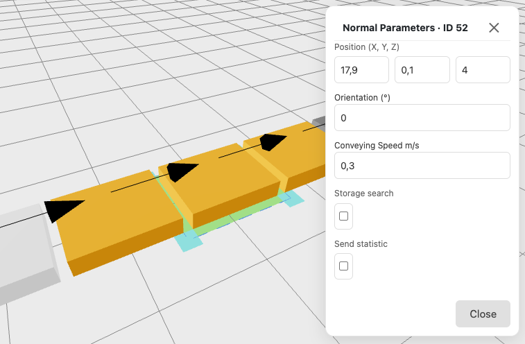

 

The Conveyor moves a loading unit to the next connected element. A conveyor serves one loading unit at a time. It accepts the next loading unit only after it has completely handed over the current one.

The **Position (X, Y, Z)** defines the centre of the conveyor.

The **Orientation (°)** rotates the conveyor in 15 degrees steps by using the handles at each corner. A precision of 1 degree is achived by using the input field in the attributes panel.

The **Conveying Speed m/s** is the speed at which the conveyor hands a loading unit over to the next element, measured in meters per second. The default is 0.3 m/s.

>The time for one handover depends on the distance of the two connected elements. At the default speed, 1 m takes about ~3.3 seconds and 2 m about ~6.7 seconds. During the handover the conveyor stays occupied, so a larger distance directly reduces how many loading units per hour can pass (throughput).

:::tip[Add connection]
Each conveyor need connections which are added in the [Linking Mode](/reference/linkingmode/).
:::

The **Storage search** option lets the conveyor look for a free storage location for every arriving loading unit. You can list **Preferred racks** (for example `3,5,7`); otherwise any connected rack is used.

The **Send statistic** option records every arrival of a loading unit on this conveyor for the reports. Enable it on the conveyors you want to evaluate, for example at the end of a line to measure throughput.

## Conveyor Parameters
- Position (X, Y, Z)
- Orientation (°)
- Conveying Speed (m/s, default 0.3)
- Storage search (on/off, optional preferred racks)
- Send statistic (on/off)
