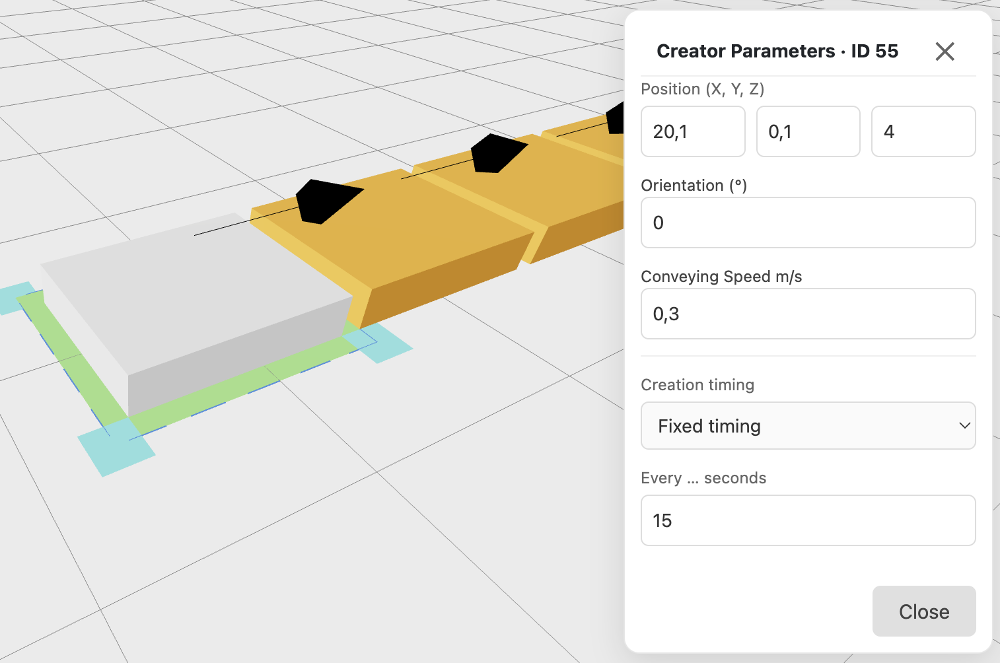

The Creator is a source position which will create loading units while the simulation is running.

A Creator holds one loading unit at a time and hands it over to the connected element (see [Conveyor](/reference/conveyor/) for more details about attributes like position, orientation, conveying speed).

The **Creation timing** is the time between two new loading units. The default is **15 seconds**, and the time must be greater than 0.

- **Fixed timing**: a new loading unit every set number of seconds.
- **Random timing**: the gaps vary around an average you enter.
- **Triangular**: you enter the earliest, most frequent and latest gap.
- **Custom mix**: you enter a list of gaps and how often each one occurs.

:::note[When the Creator is still occupied]
If a new loading unit is due but the previous one has not been handed over yet, the Creator waits. The new loading unit is created as soon as the Creator is free. In that case the real arrival rate can be lower than the configured one when jams occur.
:::

## Creator Parameters

- Position (X, Y, Z)
- Orientation (°)
- Conveying Speed (m/s, default 0.3)
- Creation timing (default: Fixed timing, 15 s)
