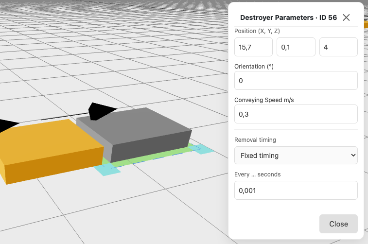

 

The Destroyer is the end point of your conveyor system. It removes every loading unit that reaches it.

Like a conveyor, a Destroyer holds one loading unit at a time. The next loading unit can only move onto the Destroyer after the previous one has been removed.

The **Position (X, Y, Z)** is the centre of the Destroyer. Place it directly next to the element that feeds it: the handover takes longer the farther apart the two elements are (see [Conveyor](/reference/conveyor)).

The **Removal timing** is how long a loading unit stays on the Destroyer before it is removed.
- Default: 0 seconds. The loading unit is removed as soon as it arrives, and the Destroyer is free again immediately.
- Set a time greater than 0 if the end point takes time in reality, for example a worker who unloads each pallet by hand. While the time runs, the Destroyer is occupied and loading units in front of it have to wait.

You can choose how the removal time is generated:
- **Fixed timing**: every loading unit stays the same time (0 or more seconds).
- **Random timing**: the time varies around an average you enter.
- **Triangular**: you enter the earliest, most frequent and latest time.
- **Custom mix**: you enter a list of times and how often each one occurs.

:::note[Conveyor with multiple Destroyers]
To simulate multiple Destroyers, do not connect them all to the same conveyor. Instead, place a short conveyor between the junction and the Destroyers as a buffer. This helps reduce the impact of jams caused by the lack of routing intelligence.
:::

## Destroyer Parameters
- Position (X, Y, Z)
- Orientation (°)
- Removal timing (default: Fixed timing, 0 s)
