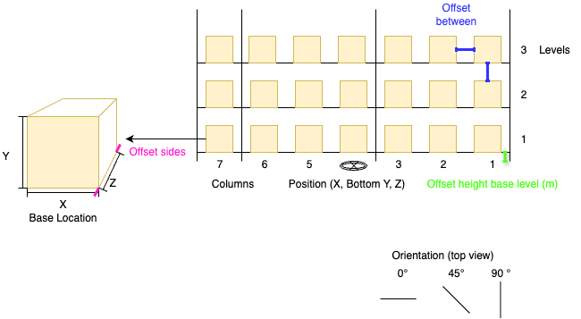

 

The Rack stores loading units. All storage locations share the same length, width, and height, defined by the Base Location (X, Y, Z) dimensions. The spacing between adjacent locations is controlled by Offset between (horizontal and vertical). Offset sides is the clearance that remains on the sides after a loading unit is stored. Offset height base level (m) sets the height of the first storage level; set it to 0 to allow storage on the floor.

The rack’s Position is specified as (X, Bottom Y, Z). This represents the rack’s center point projected to its base elevation; Bottom Y is the elevation of the rack’s bottom. A Bottom Y of 0.0 places the rack on the floor. Orientation rotates the rack around the vertical axis: 0° aligns north to south, and 90° aligns east to west.

First, draw a rack. Then select it to open the Rack parameters panel on the right side. As you edit values, the rack updates in real time. Racks created later inherit most values, except Position, which is set by where you click in the editor.

## Rack Parameters
- Columns
- Levels
- Base Location (X, Y, Z)
- Offset sides
- Offset between
- Offset height base level (m)
- Position (X, Bottom Y, Z)
- Orientation (degrees)