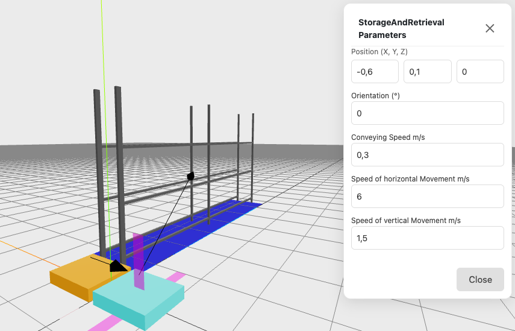

 

The Storage and Retrieval Machine, or SRM for short, connects the conveyor system and rack. It can place loading units inside the rack and retrieve them when needed. It has two axes of movement: one horizontal axis and one vertical axis. The horizontal movement follows the Z-axis when the orientation is 0° or 180°, and follows the X-axis when the orientation is 90° or 270°. The SRM can be oriented at any angle, always aligning with the rack and conveyors.

The **Position (X, Y, Z)** is the starting position of the machine. It can reach all connected conveyors and racks.

The **Conveying Speed** is the speed used to take over and hand over loading units, measured in meters per second.

The **Speed of Horizontal Movement** is the speed of the drivetrain, measured in meters per second.

The **Speed of Vertical Movement** is the speed of the lift, measured in meters per second.

:::note[Actually no acceleration]
In reality, an SRM starts slowly and gradually reaches top speed. The simulation jumps directly to top speed. Use a lower top speed to simulate acceleration behavior.
:::

## SRM Parameters
- Position (X, Bottom Y, Z)
- Orientation (degrees)
- Conveying Speed (m/s)
- Speed of horizontal Movement (m/s)
- Speed of vertical Movement (m/s)