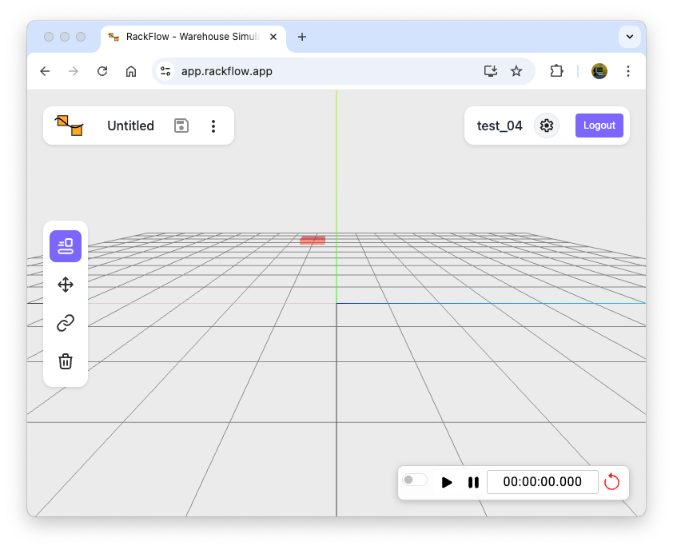
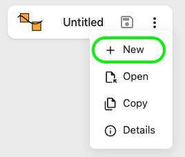
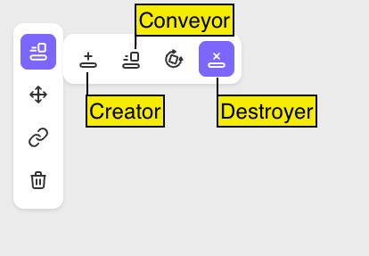
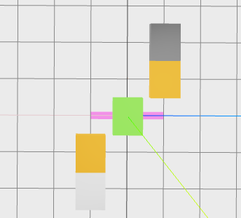
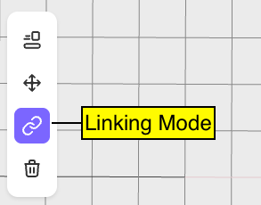
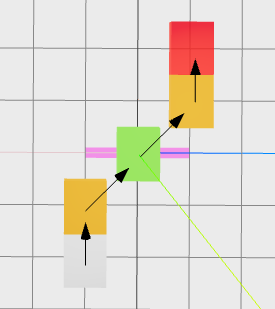
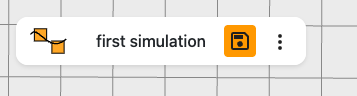

This Hands-On tutorial guides you though the steps to get your simulation running for the very first time. 

## Sign-Up

Rackflow is a cloud based framework to simulate warehouses. There is no need to install something on your computer. However your need a Google-Account or an Email-Adress to sign up. 

1. Go to [Sign-Up](https://app.rackflow.app/signup)
2. Accept the [Terms](https://www.rackflow.app/terms) and the [Privacy Policy](https://www.rackflow.app/privacy)
3. Choose to use your Google Account or Email for sign-up. 
4. Optional: If you use Email, you will recieve a verifaction email. Open the email and click on the verification link.

After successfull log in RackFlow is in editor mode.

## Create a Model

A Model is the basis to run a simulation. It is a simplified version of the real warehouse. Every model needs at leased one creator and one destroyer to simulate movements.

1. Open via Filemenu the 'New' 
2. Enter a name, for example 'first simulation'
3. Now place some conveyor with the mouse inside the editor Creators are light gray and destroyers are dark gray.
The next picture has one creator, two normal conveyors, one horizontal conveyor and a destroyer.   
4. Switch over to the Linking Mode to connect the elements and select each conveyor element in the direction of the material flow. Creator is the first element to select.  
5. Save the model with clicking on the floppydisc symbol (orange) at the top left corner 

Now your simulation model is ready and saved.

## Enter Simulation Mode

The Simulation Mode is controlled by the Simulation Panel in the down right corner. 

1. Switch the Simulation Mode on. The switch becomes blue and the connection links dissaper visually
2. Press Start
3. Optional: Pause to pause the simulation
3. Optional: Reset to start again from simulation time zero. Loading units will disappear.

## Congratulations 🎉

Thats all you need to do to create your own simlation.
 

