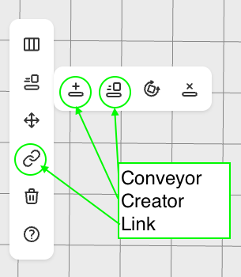
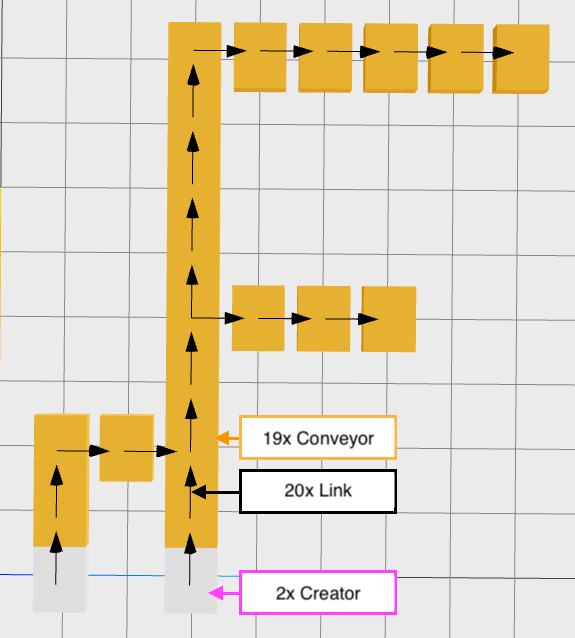
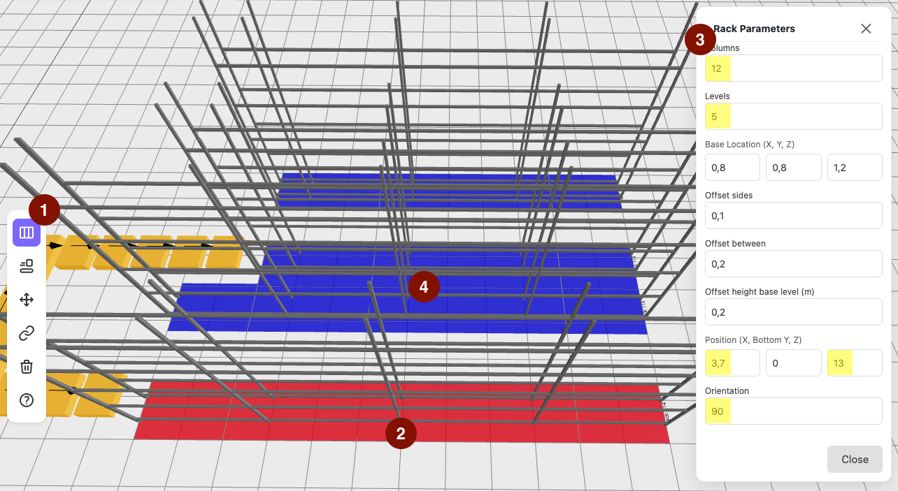
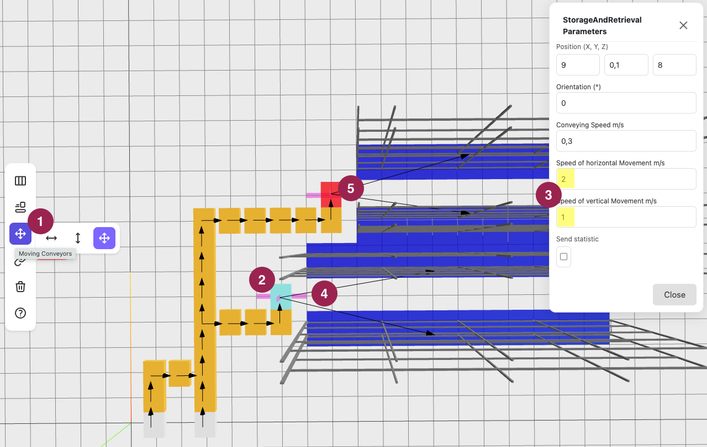
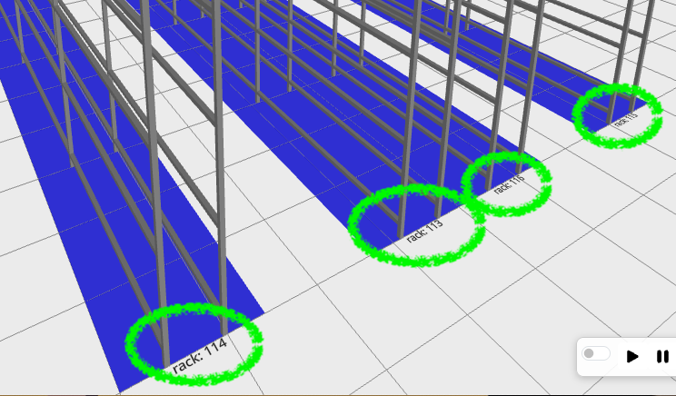
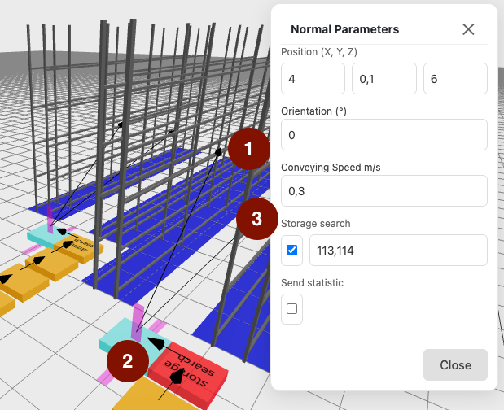
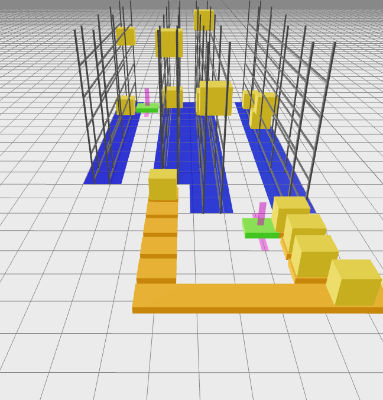

import { Steps } from '@astrojs/starlight/components';

Learn how to create loading units, build a conveyor layout with racks, and set up storage search.

Preparation:
<Steps> 
1. Log In at [Rackflow](https://app.rackflow.app/login)
2. Expand your model from [First Simulation](/tutorials/firstsimulation) or create a new one
3. Save your progress after each step.
</Steps>

## Create Conveyor System

Build a conveyor system with [Creators](/reference/creator), [Conveyors](/reference/conveyor) and [Links](/reference/linkingmode) between them. 
The Creator generates loading units. Link arrows show direction; loading units currently stop at endpoints. 
Later, connect these ends to racks using a storage and retrieval machine (SRM).

Copy the layout below or design your own.

## Define Racks

<Steps>
1. Select the rack tool from the toolbar.
2. Click on the plane to place it; the rack centers at the click position.
3. Set storage places: columns for length, rows for height. Refine position 
with X and Z coordinates (Y is fixed on the ground). Rotate by setting orientation to 90°. 
4. Repeat steps 1-3 for additional racks.
  
</Steps>

See [racks](/reference/rack) for details. Save explicitly using the disk icon.

## Add Storage and Retrival Machines

The [SRM](/reference/srm) moves along horizontal and vertical axes to place loading units in racks. 

<Steps>
1. Select SRM from the toolbar.
2. Place it near the target racks and handover conveyor.
3. Set speeds: 2 m/s for horizontal (travel) axis, 1 m/s for vertical (lift) axis.
4. Switch to Linking Mode in the toolbar. Connect the final conveyor to the SRM, then the SRM to both racks. 
5. Repeat for the second SRM. 
</Steps>

Save the progress.

## Add Storage search

Loading units need a target storage location to enter racks. 
Configure storage search on the conveyor before the aisle.

<Steps>
1. Note rack IDs (e.g., 113 and 114 for the first aisle; yours may differ).
2. Select the conveyor in front of the aisle. 
3. Enable Storage Search and enter target rack IDs (e.g., 113, 114). 
4. Repeat for the second aisle with its rack IDs.

</Steps>

Save again 💾

:::note[Actually no routing]
Routing is not implemented, so units distribute randomly at junctions. Place storage search 
after the last junction for the target racks.
:::

## Start and Test the Simulation

Switch to [Simulation Mode](/tutorial/firstSimulation/#enter-simulation-mode) and run for 
a few minutes. Verify each rack receives one loading unit.

## Congratulations 🎉

Your warehouse is now loading.

