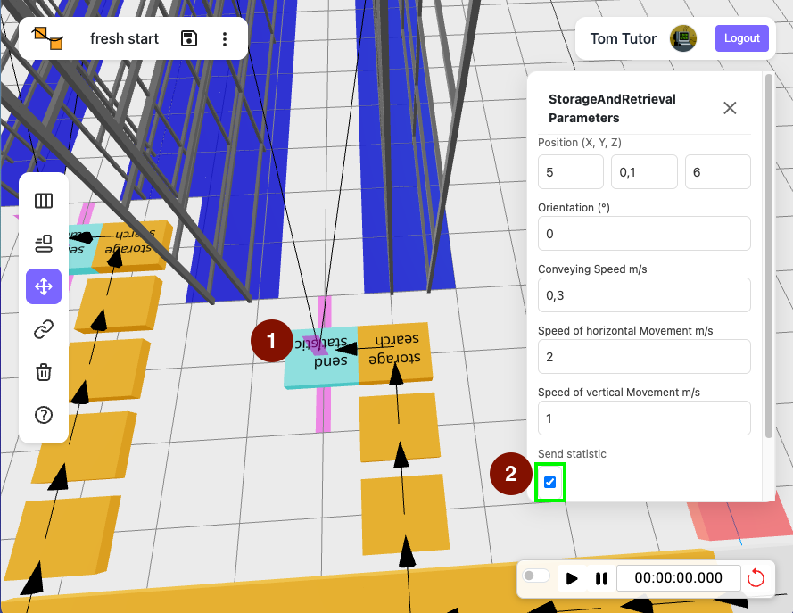
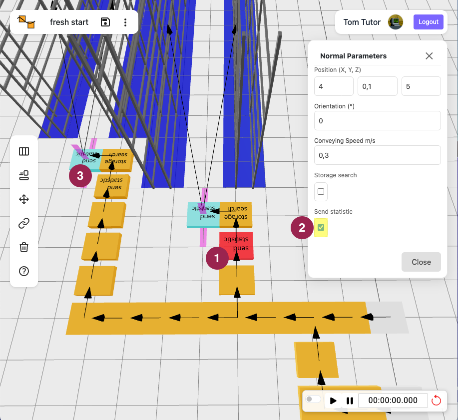
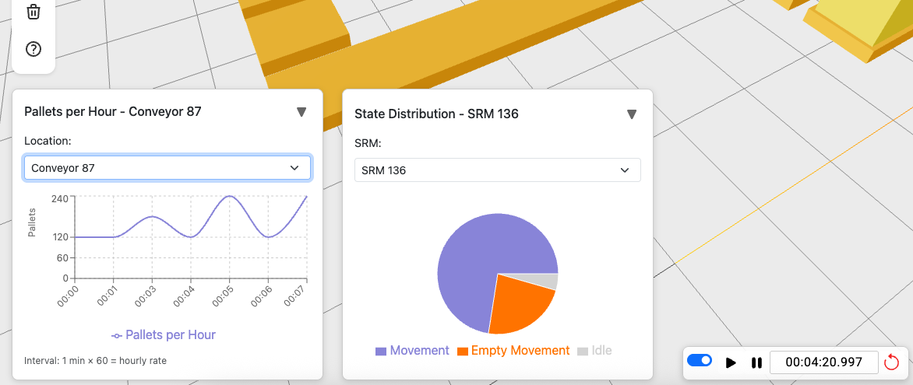

import { Steps } from '@astrojs/starlight/components';

Learn how to enable statistics and view charts in Simulation Mode.

## Preparation

<Steps>
1. Log in at [Rackflow](https://app.rackflow.app/login)
2. Use a model with conveyors, racks, and SRMs. Expand from [First Storage](/tutorials/firststorage/) 
or your own model.
</Steps>

## Activate Statistics for SRMs

<Steps>
1. Select an SRM.
2. Enable "Send statistic".
3. Repeat for each SRM.
</Steps>

## Activate Statistics for Convevors

<Steps>
1. Select a conveyor.
2. Enable "Send statistic".
3. Repeat for each key conveyors.
</Steps>

## Run Simulation and View Charts

Switch to [Simulation Mode](/tutorial/firstSimulation/#enter-simulation-mode) and run for 
a few minutes. Confirm statistics appear for configured devices.

Charts appear minimized at the bottom; click the triangle to expand. 
The left graph shows pallets per hour (calculated per minute). The right pie chart displays 
SRM utilization; use the dropdown to switch devices or locations.

## Congratulations 🎉

Your warehouse simulation now tracks statistics.

